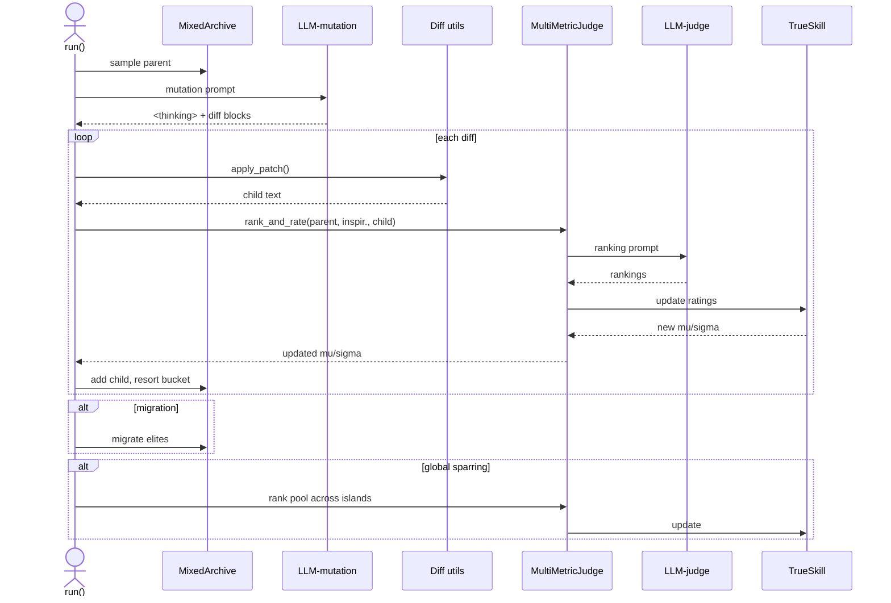
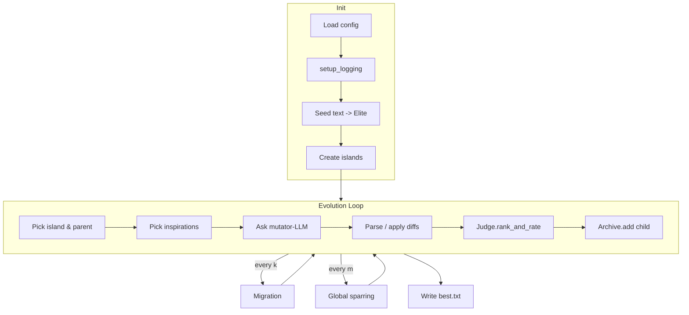

# fuzzyevolve

> Inspired by AlphaEvolve - but can work on any text, evolving using fuzzy criteria like "creative", "funny", "interesting", etc.

`fuzzyevolve` is an experimental playground that *mutates* pieces of text (prompts, prose, code snippets – anything), scores each mutation with a multi‑metric LLM judge, and maintains diversity with a MAP‑Elites archive. The result is an **always‑improving population** of texts, automatically steered toward whatever creative goal you configure.

---

## Table of Contents

1. [Features](#features)
2. [Quick Start](#quick-start)
3. [Configuration](#configuration)
4. [Workflow & Architecture](#workflow--architecture)

   * [Sequence diagram](#sequence-diagram)
   * [Flow diagram](#flow-diagram)
5. [Repository Layout](#repository-layout)
6. [Extending the System](#extending-the-system)
7. [Development Setup](#development-setup)
8. [License](#license)

---

## Features

| Category              | Highlights                                                                                                                                         |
| --------------------- | -------------------------------------------------------------------------------------------------------------------------------------------------- |
| **Evolutionary core** | *MAP‑Elites* archive with **top‑k** elites per cell, multi‑island architecture, youth‑bias sampling, periodic migration & global sparring.         |
| **LLM ensemble**      | Probabilistic model picker (`pick_model`) lets you blend fast & slow models (e.g. Gemini Flash vs Pro).                                            |
| **Judge & scoring**   | One LLM ranks candidates across *N* metrics. Ratings are updated with **TrueSkill** (one environment per metric) – uncertainty aware and additive. |
| **Mutation grammar**  | Mutator LLM returns standard `<<<<<<< SEARCH … ======= … >>>>>>> REPLACE` patches – easy to diff & undo.                                           |
| **Rich UX**           | Colour console logging, animated progress bar, optional `MutationViewer` that live‑renders recent diffs.                                           |
| **Config‑first**      | All knobs (axes, metrics, model weights, iterations…) live in a single \[TOML/JSON] config file.                                                   |
| **Pure Python ≥3.10** | No compiled extensions; runs anywhere you can `pip install`.                                                                                       |

---

## Quick Start

To get started with `fuzzyevolve`, follow these steps:

1.  **Clone the repository:**
    ```bash
    git clone https://github.com/yourname/fuzzyevolve.git
    cd fuzzyevolve
    ```

2.  **Install dependencies:**
    It is recommended to use a virtual environment.
    ```bash
    python -m venv .venv
    source .venv/bin/activate
    pip install -e .
    ```

3.  **Set up your LLM provider:**
    By default, `fuzzyevolve` uses Google Gemini. Ensure you have the necessary environment variables set for authentication. You can also edit the `config.toml` to use other models supported by [LiteLLM](https://github.com/BerriAI/litellm).

4.  **Run the evolution:**
    You can provide the initial text as an argument, a file path, or via standard input.

    *   **From a string:**
        ```bash
        fuzzyevolve "This is my starting prompt."
        ```

    *   **From a file:**
        ```bash
        echo "This is my starting prompt." > seed.txt
        fuzzyevolve seed.txt
        ```

    *   **From stdin:**
        ```bash
        cat seed.txt | fuzzyevolve
        ```
    The best result will be saved to `best.txt` by default. You can specify a different output file with the `-o` or `--output` option.

---

## Configuration

`fuzzyevolve` can be configured via a TOML or JSON file (specified with the `--config` option) and command-line arguments. Command-line arguments will override any values set in the configuration file.

Here is an example `config.toml`:

```toml
iterations = 1000
num_islands = 4
k_top = 5
migration_every = 100
migrants_per_island = 2
sparring_every = 50
youth_bias = 0.5
n_diffs = 1
log_every = 10

[axes]
lang = ["txt"]
len = { bins = [0, 100, 500, 1000, 2000] }

metrics = ["creativity", "clarity", "impact"]

[[llm_ensemble]]
model = "gemini-2.5-flash"
p = 0.8
temperature = 1.0

[[llm_ensemble]]
model = "gemini-2.5-pro"
p = 0.2
temperature = 0.8

judge_model = "gemini-2.5-pro"

mutation_prompt_goal = "Evolve this text to be more persuasive."
mutation_prompt_instructions = "Propose a single SEARCH/REPLACE diff block to improve the text."
```

### Command-Line Options

*   `--config` / `-c`: Path to a TOML or JSON config file.
*   `--output` / `-o`: Path to save the best final result.
*   `--iterations` / `-i`: Number of evolution iterations.
*   `--goal` / `-g`: The high-level goal for the mutation prompt.
*   `--metric` / `-m`: A metric to evaluate against (can be specified multiple times).
*   `--judge-model`: The LLM to use for judging candidates.
*   `--log-file`: Path to write detailed logs.
*   `--quiet` / `-q`: Suppress the progress bar and non-essential logging.

For a full list of configuration options, please refer to the `Config` class in `fuzzyevolve/config.py`.

---

## Workflow & Architecture

### Sequence diagram



### Flow diagram



---

## Repository Layout

```
fuzzyevolve/
├── evolution/
│   ├── archive.py         # MAP-Elites archive implementation
│   ├── driver.py          # Main evolutionary loop driver
│   ├── judge.py           # LLM-based multi-metric judge
│   └── scoring.py         # TrueSkill scoring implementation
├── llm/
│   ├── client.py          # LLM provider client
│   ├── parsers.py         # Parsers for LLM responses
│   └── prompts.py         # Prompt building functions
├── utils/
│   ├── diff.py            # Diff application utilities
│   └── logging.py         # Logging setup
├── cli.py                 # Command-line interface (Typer)
├── config.py              # Configuration loading
└── datamodels.py        # Core data models (Pydantic)

best.txt                   # Default output file
pyproject.toml             # Project metadata and dependencies
README.md                  # This file
```

---

## Extending the System

| Want to…                    |  How                                                                                                                   |
| --------------------------- | ---------------------------------------------------------------------------------------------------------------------- |
| **Add metrics**             | Append names to `metrics` array; TrueSkill envs & judge prompt auto‑expand.                                            |
| **Change descriptor space** | Edit `[axes]` in config and ensure your code sets those descriptor keys before `archive.add()`.                        |
| **Swap LLM back‑end**       | `pip install` whatever LiteLLM supports and change `model=` strings.                                                   |
| **Evolve other artefacts**  | Feed binary‑friendly descriptors & patch logic (e.g., JSON merge, AST diffs).                                          |
| **Web UI**                  | The dependency list already includes Flask‑SocketIO – wire `MutationViewer` into a websocket for real‑time dashboards. |

---

## Development Setup

```bash
# Dev extras install
$ pip install -e .[dev]

# Lint & format
$ ruff check .
$ ruff format .

# Type‑check
$ mypy fuzzyevolve/

# Run tests (if you add pytest suites)
$ pytest -q
```

---

## License

This project is licensed under the **Apache 2.0 License**. See [`LICENSE`](LICENSE) for details.
