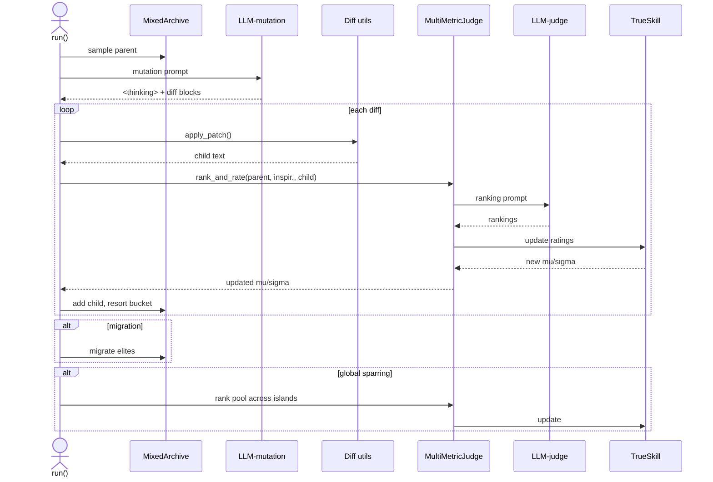
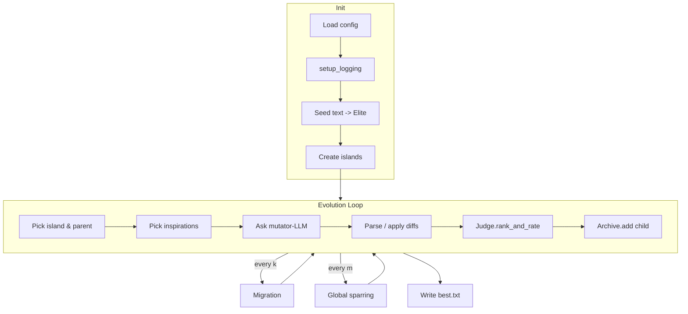

# fuzzyevolve

> Inspired by AlphaEvolve - but can work on any text, evolving using fuzzy criteria like "creative", "funny", "interesting", etc.

`fuzzyevolve` is an experimental playground that *mutates* pieces of text (prompts, prose, code snippets – anything), scores each mutation with a multi‑metric LLM judge, and maintains diversity with a MAP‑Elites archive. The result is an **always‑improving population** of texts, automatically steered toward whatever creative goal you configure.

---

## Table of Contents

1. [Features](#features)
2. [Quick Start](#quick-start)
3. [Configuration](#configuration)
4. [Workflow & Architecture](#workflow--architecture)

   * [Sequence diagram](#sequence-diagram)
   * [Flow diagram](#flow-diagram)
5. [Repository Layout](#repository-layout)
6. [Extending the System](#extending-the-system)
7. [Development Setup](#development-setup)
8. [License](#license)

---

## Features

| Category              | Highlights                                                                                                                                         |
| --------------------- | -------------------------------------------------------------------------------------------------------------------------------------------------- |
| **Evolutionary core** | *MAP‑Elites* archive with **top‑k** elites per cell, multi‑island architecture, youth‑bias sampling, periodic migration & global sparring.         |
| **LLM ensemble**      | Probabilistic model picker (`pick_model`) lets you blend fast & slow models (e.g. Gemini Flash vs Pro).                                            |
| **Judge & scoring**   | One LLM ranks candidates across *N* metrics. Ratings are updated with **TrueSkill** (one environment per metric) – uncertainty aware and additive. |
| **Mutation grammar**  | Mutator LLM returns standard `<<<<<<< SEARCH … ======= … >>>>>>> REPLACE` patches – easy to diff & undo.                                           |
| **Rich UX**           | Colour console logging, animated progress bar, optional `MutationViewer` that live‑renders recent diffs.                                           |
| **Config‑first**      | All knobs (axes, metrics, model weights, iterations…) live in a single \[TOML/JSON] config file.                                                   |
| **Pure Python ≥3.10** | No compiled extensions; runs anywhere you can `pip install`.                                                                                       |

---

## Quick Start

```bash
# 1.  Clone & install
$ git clone https://github.com/yourname/fuzzyevolve.git
$ cd fuzzyevolve
$ python -m venv .venv && source .venv/bin/activate
$ pip install -e .  # installs using pyproject.toml

# 2.  Provide a seed file
$ echo "This is my starting prompt." > seed.txt

# 3.  Run it (defaults are fine to try it out)
$ python fuzzyevolve/main.py
# … Rich progress bar appears; best sample saved to best.txt on exit
```

> **Note**: The default config expects **Google Gemini via Vertex AI**. Either:
>
> * set the env vars required by `google-cloud-aiplatform`, **or**
> * edit `config.toml` to point at OpenAI / Anthropic models supported by [LiteLLM](https://github.com/BerriAI/litellm).

---

## Configuration

Create `myconfig.toml` (or JSON) and pass via `--config`.

```toml
iterations      = 2000      # how long to evolve
log_every       = 25        # console log frequency
num_islands     = 4         # independent archives
k_top           = 6         # elites per cell
migration_every = 500       # migrate between islands
migrants_per_island = 4

# Behaviour descriptor space (axes)
[axes]
lang = ["txt"]                    # categorical axis
len  = { bins = [0, 500, 1000, 2000, 1e9] }  # numeric axis → bins

# What you are optimising for – any labels you like
metrics = ["taste", "quality", "originality"]

# LLM ensemble (mutation models)
[[llm_ensemble]]
model = "vertex_ai/gemini-2.5-flash-preview-05-20"
p     = 0.85        # selection probability
temperature = 1.2

[[llm_ensemble]]
model = "vertex_ai/gemini-2.5-pro-preview-06-05"
p     = 0.15

# Judge model (ranks candidates)
judge_model = "vertex_ai/gemini-2.5-pro-preview-06-05"

# Prompts
mutation_prompt_goal         = "write a prompt for a coding agent…"
mutation_prompt_instructions = "Propose SEARCH/REPLACE diff blocks…"
```

Every field in `Config` can be overridden – see `main.py` > `class Config` for defaults.

---

## Workflow & Architecture

### Sequence diagram



### Flow diagram



---

## Repository Layout

```
fuzzyevolve/
├── utils/
│   ├── logging_setup.py   # Rich/TTY logging
│   └── mutation_viewer.py # Rich Live diff viewer
├── main.py                # Evolution engine & CLI
├── seed.txt               # (user‑supplied) starting text
├── best.txt               # output – best elite after run
├── pyproject.toml         # deps & metadata
└── .gitignore             # housekeeping
```

---

## Extending the System

| Want to…                    |  How                                                                                                                   |
| --------------------------- | ---------------------------------------------------------------------------------------------------------------------- |
| **Add metrics**             | Append names to `metrics` array; TrueSkill envs & judge prompt auto‑expand.                                            |
| **Change descriptor space** | Edit `[axes]` in config and ensure your code sets those descriptor keys before `archive.add()`.                        |
| **Swap LLM back‑end**       | `pip install` whatever LiteLLM supports and change `model=` strings.                                                   |
| **Evolve other artefacts**  | Feed binary‑friendly descriptors & patch logic (e.g., JSON merge, AST diffs).                                          |
| **Web UI**                  | The dependency list already includes Flask‑SocketIO – wire `MutationViewer` into a websocket for real‑time dashboards. |

---

## Development Setup

```bash
# Dev extras install
$ pip install -e .[dev]

# Lint & format
$ ruff check .
$ ruff format .

# Type‑check
$ mypy fuzzyevolve/

# Run tests (if you add pytest suites)
$ pytest -q
```

---

## License

This project is licensed under the **Apache 2.0 License**. See [`LICENSE`](LICENSE) for details.
